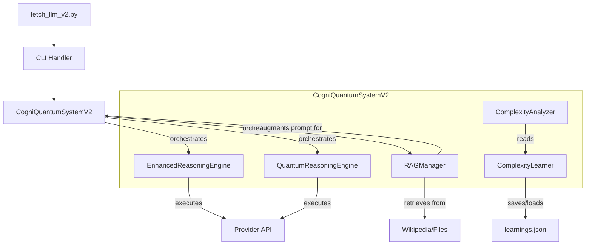

# CogniQuantum: Advanced Reasoning System for Large Language Models

## Breaking Through "The Illusion of Thinking" - A Research-Based Implementation

**CogniQuantum** は、Apple Researchの画期的な論文["The Illusion of Thinking"](https://ml-site.cdn-apple.com/papers/the-illusion-of-thinking.pdf)で特定された根本的な限界を克服するソリューションを実装した革新的なLLMインターフェースです。このアップデート版では、Retrieval-Augmented Generation (RAG)、量子インスピレーション推論、自己改善複雑性分析などの強力な新機能を導入しています。

[](https://python.org)
[](LICENSE)
[](https://ml-site.cdn-apple.com/papers/the-illusion-of-thinking.pdf)
[](README.md)

---

## 🚀 **主要機能とモード**

### **研究ベースの推論モード**

あらゆる複雑性に対応する推論モードスイートを提供し、新しい戦略で強化されています。

| モード | 対象複雑性 | 主要メリット | 使用例 |
|---|---|---|---|
| `efficient` | 低 | **過度思考防止** | 簡単な質問、基本タスク |
| `balanced` | 中 | 最適推論品質 | 標準分析、説明 |
| `decomposed` | 高 | **破綻防止と速度** | 複雑問題解決、システム設計 |
| `adaptive` | 自動検出 | **動的最適化** | 複雑性不明または混合質問 |
| `parallel` | 全て | **最高品質** | ミッションクリティカル、最高品質要求 |
| `quantum_inspired` | 全て | 包括的統合洞察 | ブレインストーミング、哲学的質問、戦略 |
| `edge` | 低 | 軽量・高速 | 低リソースデバイス、クイックチェック |
| `paper_optimized` | 全て | 完全研究統合 | 最大研究効果、ベンチマーク |

### **高度機能**

- **自動複雑性分析**: リアルタイム多言語問題複雑性評価
- **自己改善分析**: 過去のやり取りから学習し、将来をより賢く決定
- **動的戦略選択**: 問題ごとに最適な推論アプローチを選択
- **検索拡張生成 (RAG)**: **Wikipedia**またはローカルファイル/URLからの外部知識でプロンプトを拡張
- **過度思考・破綻防止**: 効率性と推論品質を維持するコアメカニズム
- **マルチプロバイダーサポート**: OpenAI, Claude, Gemini, Ollama, HuggingFace
- **構造化思考プロセス**: 完全な透明性のための詳細推論ステップ出力

---

## 🛠️ インストールとクイックスタート

### **必要環境**
- Python 3.10+
- 全依存関係インストール: `pip install -r requirements.txt`
- 最低1つのLLMプロバイダーAPIキーまたはローカルOllamaセットアップ

### **セットアップ**
```bash
# リポジトリをクローン
git clone https://github.com/littlebuddha-dev/Cogni-Quantum.git
cd Cogni-Quantum

# 必要な依存関係をすべてインストール
pip install -r requirements.txt

# 環境ファイルを作成・設定
cp .env.example .env
# APIキー（OPENAI_API_KEY等）で.envを編集

# セットアップをテスト
python quick_test_v2.py
```

### **即座の使用**

```bash
# 基本効率テスト
python fetch_llm_v2.py ollama "日本の首都は何ですか？" --mode efficient

# 破綻防止による複雑推論
python fetch_llm_v2.py claude "持続可能な都市交通システムを設計してください。" --mode decomposed

# 複雑性不明の適応モード
python fetch_llm_v2.py openai "雇用市場におけるAIの経済的影響を分析してください。" --mode adaptive

# 深い洞察のための量子インスピレーション統合
python fetch_llm_v2.py openai "意識の本質とは何か？" --mode quantum_inspired

# Wikipedia使用のRAG駆動クエリ
python fetch_llm_v2.py openai "LIGO実験の主要発見は何でしたか？" --mode balanced --wikipedia
```

---

## 🎮 使用例

### **RAGを使った学術研究**

```bash
# Wikipediaからの最新情報でクエリを拡張
python fetch_llm_v2.py claude \
"最近の発見に基づいて、量子コンピューティングの主要課題は何ですか？" \
--mode balanced --wikipedia
```

### **ビジネス戦略統合**

```bash
# 量子インスピレーションモードで多面的戦略を生成
python fetch_llm_v2.py openai \
"楽観的、悲観的、倫理的観点を考慮して、ヨーロッパでのAIスタートアップの包括的市場参入戦略を開発してください。" \
--mode quantum_inspired
```

### **技術問題解決**

```bash
# 分解戦略を使った複雑システム設計
python fetch_llm_v2.py ollama \
"ソーシャルメディアアプリの高可用性・スケーラブルマイクロサービスアーキテクチャを設計してください。" \
--mode decomposed --model deepseek-r1
```

---

## 🔬 アーキテクチャと実装

V2アーキテクチャは、RAG、自己学習、高度推論パイプラインの新コンポーネントを統合します。

### **コアコンポーネント**



### **研究実装パイプライン**

1. **入力**: ユーザープロンプトを受信
2. **RAG（オプション）**: RAGManagerが検索クエリを抽出し、Wikipediaまたはローカルファイルからコンテキストを取得してプロンプトを拡張
3. **複雑性分析**: AdaptiveComplexityAnalyzerが複雑性を評価、ComplexityLearnerからの提案を利用可能
4. **パイプライン選択**: 選択モードに基づいて推論パイプライン（EnhancedReasoningEngine、QuantumReasoningEngine、Parallel）を選択
5. **実行**: 選択エンジンがプロンプトを処理し、レジーム固有戦略（分解、過度思考防止等）を適用
6. **自己修正（適応モード）**: システムが不十分解を再評価し、別試行のため複雑性レジームをエスカレート可能
7. **学習**: 複雑性が調整された場合、ComplexityLearnerが成功結果を記録して将来分析を改善
8. **出力**: 詳細思考プロセスを含む最終構造化ソリューションを返す

---

## 🧪 テストと検証

システム安定性とパフォーマンスを確保する包括的テストスイートを含みます。

```bash
# クイックシステムヘルスチェック
python quick_test_v2.py

# 全利用可能V2プロバイダーとモードの包括テスト実行
python test_all_v2_providers.py
```

---

## 🤝 サポートプロバイダー

| プロバイダー | 標準 | 強化V2 | 特別機能 |
|---|---|---|---|
| OpenAI | ✅ | ✅ | GPT-4o最適化、ビジョンサポート |
| Claude | ✅ | ✅ | 推論特化、大コンテキスト |
| Gemini | ✅ | ✅ | マルチモーダル、速度最適化 |
| Ollama | ✅ | ✅ | ローカルモデル、プライバシー、コスト無料、並行安全 |
| HuggingFace | ✅ | ✅ | オープンソース多様性、実験 |

---

## 📚 開発者API

コアロジックを他のPythonアプリケーションに直接統合できます。

### **直接システム使用**

```python
# /main_api_example.py
# タイトル: API使用例
# 役割: CogniQuantumSystemV2をPythonアプリケーションで直接使用する方法を示す

import asyncio
from llm_api.providers import get_provider
from llm_api.cogniquantum import CogniQuantumSystemV2, ComplexityRegime

async def run():
    # 強化プロバイダーを取得
    provider = get_provider('openai', enhanced=True)
    
    # プロバイダーのenhanced_callは内部でCogniQuantumSystemV2を使用
    result = await provider.call(
        "金融モデリング用の量子古典ハイブリッドアルゴリズムを設計してください。",
        mode='decomposed'  # V2モードを使用
    )

    if not result.get('error'):
        print("最終解決案:\n", result['text'])
        # 構造化思考プロセスにアクセス
        thought_process = result.get('paper_based_improvements', {}).get('thought_process', {})
        print("\n思考プロセス:\n", thought_process)

if __name__ == "__main__":
    asyncio.run(run())
```

---

## 📜 ライセンス

MIT License - 詳細はLICENSEファイルを参照してください。

これは公開されているApple Research論文に基づく独立研究実装であり、Apple公式製品ではありません。